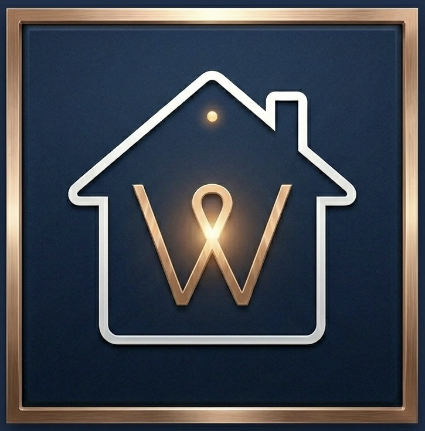
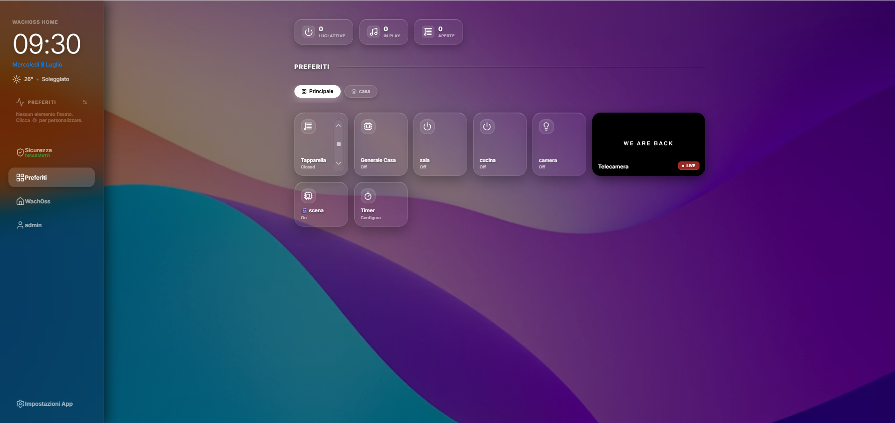
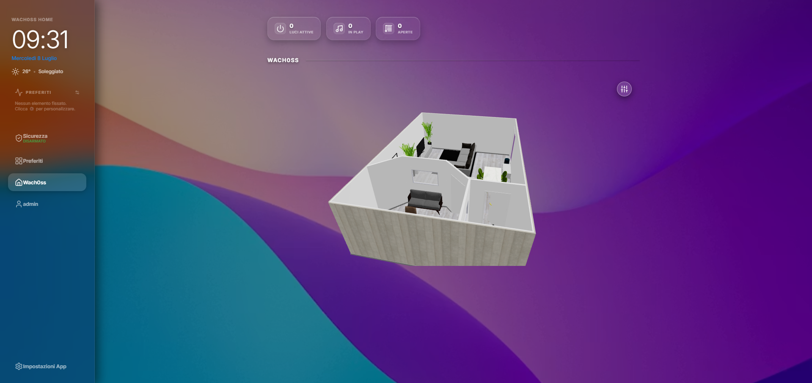
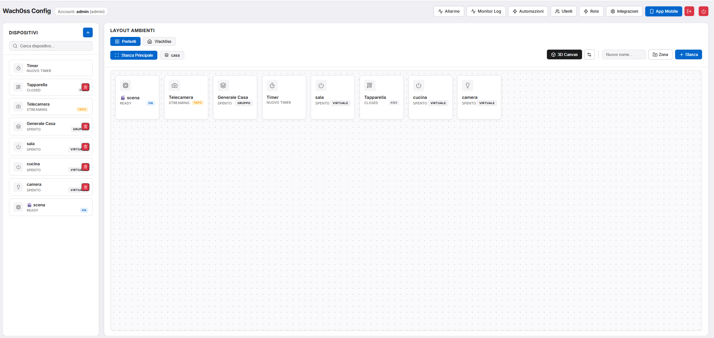
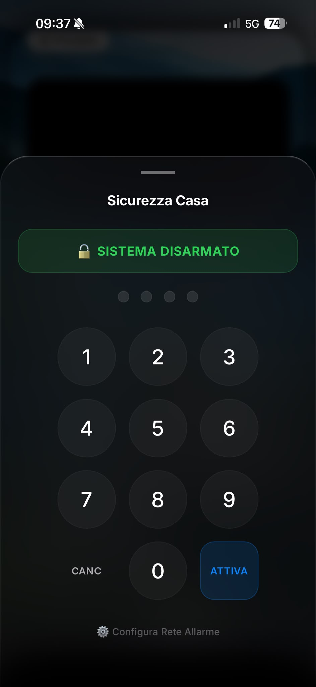
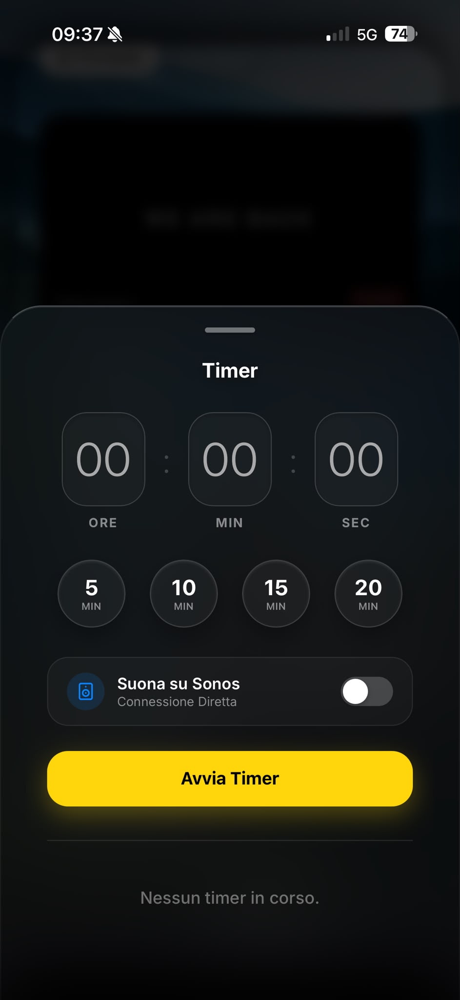
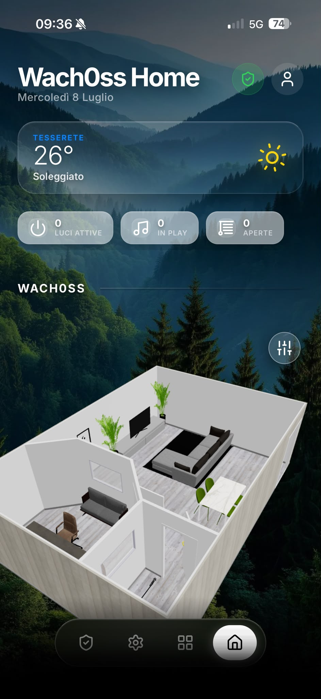

<div align="center">

  

  <h1>🌌 Wach0ss Home</h1>

  <p>
    <em>L'Hub Domotico Definitivo: unisce KNX, Home Assistant, Shelly e Sonos in un'unica incredibile interfaccia 3D.</em>
  </p>

  <p>
    
    
    
  </p>
  
  <p>
    <a href="#-esplora-il-progetto">Esplora</a> •
    <a href="#-funzionalità-principali">Funzioni</a> •
    <a href="#-installazione-veloce">Installazione</a> •
    <a href="#-galleria">Galleria</a>
  </p>

</div>

---

## 🚀 Esplora il Progetto

**Wach0ss Home** non è una semplice dashboard, è un vero e proprio server domotico. Progettato per superare ogni limite di integrazione, ti permette di mappare la tua casa tramite piantine 3D interattive e gestirla con un motore logico potentissimo.

Ideale per sistemi Linux e **Raspberry Pi**, include sistemi di accesso remoto sicuro (ZeroTier e Cloudflare) configurabili con un solo click.

---

## ✨ Funzionalità Principali

*   🔌 **Integrazione Nativa:** Controllo diretto su bus **KNX**, auto-discovery locale per **Shelly** (Gen 1 & 2), rilevamento automatico **Sonos** e integrazione profonda con **Home Assistant**.
*   🗺️ **Piantine 3D Interattive:** Carica i tuoi file `.glb` e controlla luci e tapparelle cliccando direttamente sulla riproduzione 3D di casa tua.
*   🎥 **Streaming Tapo Anti-Lag:** Motore video integrato con OpenCV per flussi RTSP fluidi e in tempo reale.
*   🧠 **Automazioni & Scenari:** Motore logico proprietario per creare routine (orari, stati, range temporali) e "Snapshots" istantanei della casa.
*   🚨 **Sistema di Allarme Integrato:** Inserimento con PIN, ritardo di uscita, attivazione sirene via Sonos e notifiche dirette su Telegram.
*   🌍 **Accesso Remoto 1-Click:** Demoni Cloudflare e ZeroTier preconfigurati.

---

## 📸 Galleria

<div align="center">
  <table>
    <tr>
      <td align="center"><b>📱 Schermata Principale</b></td>
      <td align="center"><b>⚙️ Impostazioni / Automazioni</b></td>
    </tr>
    <tr>
      <!-- Assicurati di avere queste immagini salvate nella cartella "images" -->
      <td></td>
      <td></td>
      <td></td>
      <td></td>
      <td></td>
      <td></td>
      <td></td>
    </tr>
  </table>
</div>

---

## 💻 Installazione Veloce

Il sistema è ottimizzato per Linux/Raspberry Pi. Ti basta **un solo comando** per clonare la repository, creare l'ambiente in `/opt/` e lanciare l'installazione delle dipendenze.

Apri il terminale e lancia la magia:

```bash
git clone [https://github.com/giovanni247000/Wach0ss-home.git](https://github.com/giovanni247000/Wach0ss-home.git) /opt/wach_os && sudo bash /opt/wach_os/install.sh
