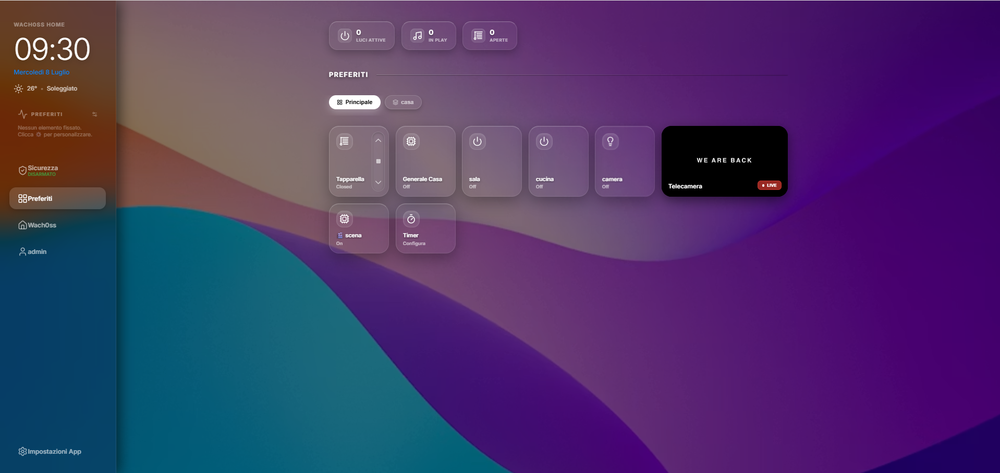
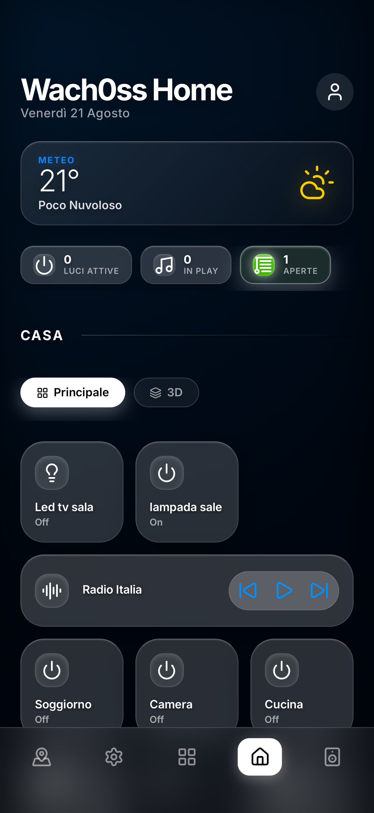
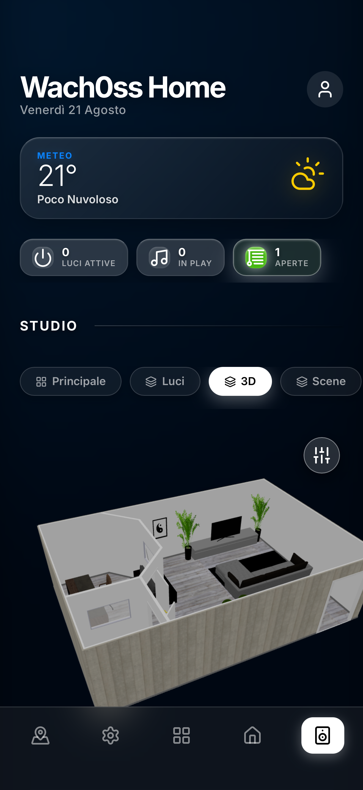
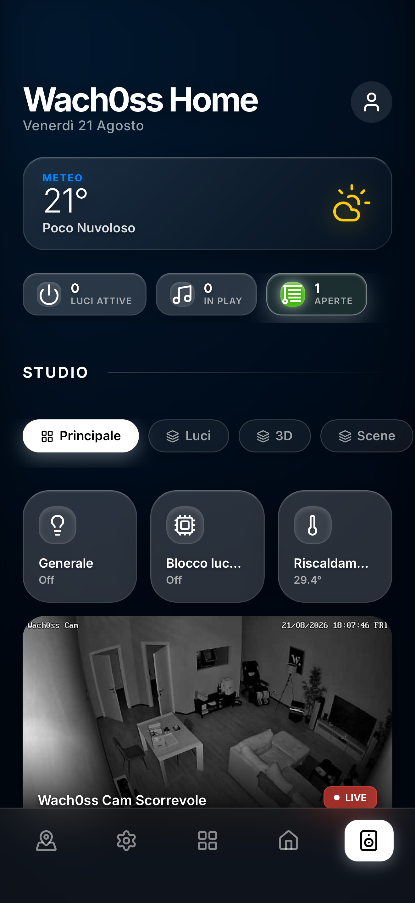

# 🌌 Wach0ss Home
**The smart home interface built around your home.**

**KNX · Home Assistant · Shelly · Sonos · Cameras · 3D**

*Experience the fluid, app-like mobile interface directly in your browser. No installation required.*

 

 

> **Wach0ss Home transforms your entire home into an interactive digital environment.**

---

## ✦ Overview

Wach0ss Home is a **self-hosted smart home platform** designed to bring multiple ecosystems together inside a single interface. Instead of switching between different applications, dashboards, and manufacturers, Wach0ss Home creates a unified control layer for your home.

At its core is an interactive **3D representation of your environment**, allowing physical devices to become part of the digital space.

*   Lights.
*   Shutters.
*   Sensors.
*   Cameras.
*   Audio & Security.

**Everything lives in one place.**

  

---

## ⚡ Features

| 🧊 Interactive 3D Home | 🔌 Multi-System Integration |
| :--- | :--- |
| Bring your real environment into the interface using custom `.glb` models. Interact directly with your rooms and devices through a digital representation of your home.  **Your house becomes the interface.** | Connect multiple ecosystems through a unified control layer: • KNX • Home Assistant • Shelly Gen 1 / Gen 2 • Sonos • Network devices  **No fragmented dashboards.** |

| 🎥 Real-Time Cameras | 🧠 Automation Engine & 🛡️ Security |
| :--- | :--- |
| Integrated video streaming powered by OpenCV with support for RTSP sources. Designed for low-latency monitoring and continuous operation on lightweight hardware like Raspberry Pi. | Build complex automations based on time, state, and scenarios. Includes a complete alarm workflow with PIN keypad, siren activation, Sonos alerts, and Telegram emergency notifications. |

---

## 🏠 The Digital Twin & Architecture

One of the main ideas behind Wach0ss Home is simple:
> **Why control your home through a list of devices when you can control it through the home itself?**

Import your own `.glb` model and turn your environment into an interactive digital twin. Tap the light, move the shutter, check the sensor, enter the room—everything happens directly inside the model.

### System Architecture
Wach0ss Home acts as an abstraction layer between the user interface and the different systems installed in the house.

                         ┌─────────────────────┐
                         │    WACH0SS HOME     │
                         │      INTERFACE      │
                         └──────────┬──────────┘
                                    │
                 ┌──────────────────┼──────────────────┐
                 │                  │                  │
                 ▼                  ▼                  ▼
             KNX BUS          HOME ASSISTANT         SHELLY
                 │                  │                  │
                 └──────────────────┼──────────────────┘
                                    │
                                    ▼
                              DEVICE LAYER
                                    │
                 ┌──────────────────┼──────────────────┐
                 │                  │                  │
                 ▼                  ▼                  ▼
               LIGHTS            SENSORS            SHUTTERS
                 │                  │                  │
                 └──────────────────┼──────────────────┘
                                    │
                                    ▼
                              PHYSICAL HOME

<h2>💻 Installation</h2>

  <b>Wach0ss Home</b> is designed primarily for Linux systems,
  including Raspberry Pi and other Linux-based machines.

<h3>📋 Requirements</h3>

<table>
  <tr>
    <td>🐧</td>
    <td><b>Linux</b></td>
    <td>Raspberry Pi or another Linux machine</td>
  </tr>
  <tr>
    <td>🐍</td>
    <td><b>Python 3.9+</b></td>
    <td>Python 3.9 or newer</td>
  </tr>
  <tr>
    <td>📦</td>
    <td><b>Git</b></td>
    <td>Required to clone the repository</td>
  </tr>
  <tr>
    <td>🔑</td>
    <td><b>sudo privileges</b></td>
    <td>Required for installation in <code>/opt</code></td>
  </tr>
</table>

 

<h3>⚡ One-Command Installation</h3>

  The easiest way to install <b>Wach0ss Home</b> is to clone the repository
  directly into <code>/opt</code> and run the installation script.

<pre><code>sudo git clone https://github.com/giovanni247000/Wach0ss-Home.git /opt/wach_os

sudo bash /opt/wach_os/install.sh</code></pre>

  🚀 Once the installation is complete, Wach0ss Home will be ready to configure.

<h2>📸 Gallery</h2>

<table>
  <tr>
    <td align="center">
      <strong>Camera Monitoring</strong>  
      
    </td>
    <td align="center">
      <strong>Mobile Interface</strong>  
      
    <td align="center">
      <strong>Mobile Interface</strong>  
      
    </td>
  </tr>
</table>

 

<h2>🛠️ Technology Stack</h2>

  Wach0ss Home is built around a modular ecosystem designed to integrate
  different smart-home technologies into a single self-hosted platform.

<table>
  <tr>
    <td>🏠 <b>KNX</b></td>
    <td>Home automation & building control</td>
  </tr>
  <tr>
    <td>🤖 <b>Home Assistant</b></td>
    <td>Smart-home integrations & automation</td>
  </tr>
  <tr>
    <td>⚡ <b>Shelly</b></td>
    <td>Energy, switches & sensors</td>
  </tr>
  <tr>
    <td>🔊 <b>Sonos</b></td>
    <td>Multi-room audio & notifications</td>
  </tr>
  <tr>
    <td>🌐 <b>Cloudflare</b></td>
    <td>Secure remote access</td>
  </tr>
  <tr>
    <td>🔐 <b>ZeroTier</b></td>
    <td>Private network connectivity</td>
  </tr>
</table>

 

<h2>🚀 Currently Supported</h2>

<ul>
  <li>🔌 KNX, Home Assistant, Shelly & Sonos integrations</li>
  <li>🌐 Interactive 3D environment & digital twin</li>
  <li>🚨 Full alarm system with PIN protection</li>
  <li>⏱️ Configurable entry & exit delays</li>
  <li>📱 Telegram & Sonos alarm notifications</li>
  <li>☁️ Cloudflare remote access</li>
  <li>🔐 ZeroTier private networking</li>
</ul>

<h2>🔮 Roadmap</h2>

<table>
  <tr>
    <td>🟢</td>
    <td><b>Current</b></td>
    <td>Core smart-home integrations & 3D environment</td>
  </tr>
  <tr>
    <td>🟡</td>
    <td><b>Coming Soon</b></td>
    <td>Advanced 3D interactions & improved mobile experience</td>
  </tr>
  <tr>
    <td>🟡</td>
    <td><b>Coming Soon</b></td>
    <td>Advanced automation editor & AI-assisted routines</td>
  </tr>
  <tr>
    <td>🟡</td>
    <td><b>Coming Soon</b></td>
    <td>Energy monitoring & presence detection</td>
  </tr>
</table>

 

<h2>🤝 Contributing & Support</h2>

  <b>Wach0ss Home</b> is a personal project, but contributions, ideas and
  feedback are always welcome.

  Experimenting with Wach0ss Home or have an idea for a new feature?
  Feel free to open an issue and share your feedback.

  ⭐ <b>If you like the project, consider giving it a star!</b>

 

  
    <b>Wach0ss Home</b> · Smart Home Platform · Self Hosted
  

