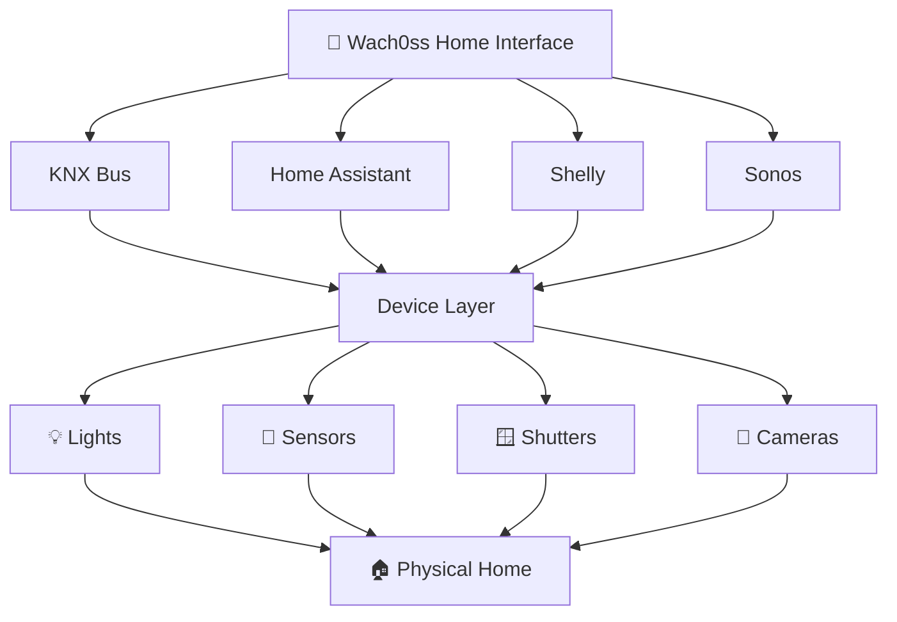

<div align="center">


# Wach0ss Home

### The smart home interface built around your home.

<p>
  <b>KNX</b> · <b>Home Assistant</b> · <b>Shelly</b> · <b>Sonos</b> · <b>Cameras</b> · <b>3D Digital Twin</b>
</p>

<a href="https://demo.wach0ss.com/mobile">
  
</a>
<a href="https://apps.apple.com/ch/app/wach0ss-home/id6794828615?l=it">
  
</a>

<i>Experience the fluid, app-like mobile interface directly in your browser — no installation required.</i>

<br><br>


</div>

<br>

> **Wach0ss Home turns your entire home into an interactive digital environment** — configured in minutes, beautiful to look at, and fast because it runs on your own network.

<br>

<div align="center">

[**Overview**](#-overview) · [**Features**](#-features) · [**Digital Twin**](#-the-digital-twin) · [**Architecture**](#-architecture) · [**Installation**](#-installation) · [**Gallery**](#-gallery) · [**Stack**](#-technology-stack) · [**Roadmap**](#-roadmap)

</div>

---

## ✦ Overview

Most smart homes end up as a pile of apps: one for the lights, one for the cameras, one for the speakers, one for the alarm. Wach0ss Home replaces that pile with a **single, self-hosted interface** — designed to be set up by anyone in a few minutes, not just by an installer with a laptop full of tools.

At its core is an interactive **3D representation of your home**. Rooms, lights, shutters and sensors aren't a list — they're a place you can walk through and touch.

<div align="center">
  
  <br><sub>The dashboard — mobile view</sub>
</div>

<br>

<table>
<tr>
<td width="33%" align="center">🎨<br><b>Beautiful</b><br><sub>A liquid-glass interface, not a spreadsheet with buttons</sub></td>
<td width="33%" align="center">⚡<br><b>Fast</b><br><sub>Runs on your local network — taps become actions instantly</sub></td>
<td width="33%" align="center">🛠️<br><b>Configurable in minutes</b><br><sub>No code, no installer required — guided setup from the app itself</sub></td>
</tr>
</table>

---

## ⚡ Features

<table>
<tr>
<td width="50%" valign="top">

### 🧊 Interactive 3D Home
Bring your real environment into the interface using custom `.glb` models. Walk through your rooms and interact with devices directly on a digital twin of your house.

**Your house becomes the interface.**

</td>
<td width="50%" valign="top">

### 🔌 Multi-System Integration
One control layer for the ecosystems you already own:
- KNX
- Home Assistant
- Shelly (Gen 1 / Gen 2)
- Sonos
- Network devices

**No more switching between apps.**

</td>
</tr>
<tr>
<td width="50%" valign="top">

### 🎥 Real-Time Cameras
Live video streaming powered by OpenCV, with RTSP support. Built for low-latency monitoring on lightweight hardware like a Raspberry Pi — no cloud subscription required.

</td>
<td width="50%" valign="top">

### 🛡️ Automation & Security
Automations based on time, state, and scenarios, plus a complete alarm workflow: PIN keypad, siren activation, Sonos audio alerts, and Telegram emergency notifications.

</td>
</tr>
</table>

---

## 🏠 The Digital Twin

One idea sits behind everything in Wach0ss Home:

> **Why control your home through a list of devices when you can control it through the home itself?**

Import your own `.glb` model and turn your environment into an interactive digital twin. Tap a light, move a shutter, check a sensor, walk into a room — it all happens directly inside the model, not in a settings menu three taps deep.

<div align="center">
  
  &nbsp;&nbsp;
  
  <br><sub>Camera monitoring · Mobile interface</sub>
</div>

---

## 🧭 Architecture

Wach0ss Home sits as an abstraction layer between the interface and whatever systems are already installed in the house — so a room doesn't need to care whether its light is wired to KNX or to a Shelly relay.


```mermaid
flowchart TD
    UI["🌌 Wach0ss Home Interface"]
    UI --> KNX["KNX Bus"]
    UI --> HA["Home Assistant"]
    UI --> SH["Shelly"]
    UI --> SO["Sonos"]

    KNX --> DL["Device Layer"]
    HA --> DL
    SH --> DL
    SO --> DL

    DL --> L["💡 Lights"]
    DL --> SE["📡 Sensors"]
    DL --> SU["🪟 Shutters"]
    DL --> CA["🎥 Cameras"]

    L --> HOME["🏠 Physical Home"]
    SE --> HOME
    SU --> HOME
    CA --> HOME
```

<sub>Remote access runs through Cloudflare Tunnel and ZeroTier — the interface is reachable from anywhere without opening a single port on the router.</sub>

---

## 💻 Installation

Wach0ss Home is designed primarily for **Linux**, including Raspberry Pi and other Linux-based machines.

### Requirements

| | Requirement | Notes |
|---|---|---|
| 🐧 | **Linux** | Raspberry Pi or another Linux machine |
| 🐍 | **Python 3.9+** | |
| 📦 | **Git** | Required to clone the repository |
| 🔑 | **sudo privileges** | Required for installation in `/opt` |

### Quick install

```bash
git clone https://github.com/giovanni247000/Wach0ss-home.git /opt/wach_os && sudo bash /opt/wach_os/install.sh
```

<details>
<summary><b>Prefer to run it as two steps?</b></summary>

<br>

```bash
sudo git clone https://github.com/giovanni247000/Wach0ss-Home.git /opt/wach_os

sudo bash /opt/wach_os/install.sh
```

</details>

🚀 Once the installation finishes, open the interface and Wach0ss Home is ready to configure — rooms, devices and the 3D model are all set up from inside the app.

---

## 📸 Gallery

<table>
<tr>
<td align="center" width="33%">
<b>Camera Monitoring</b><br><br>

</td>
<td align="center" width="33%">
<b>Mobile Interface</b><br><br>

</td>
<td align="center" width="33%">
<b>Mobile Interface</b><br><br>

</td>
</tr>
</table>

---

## 🛠️ Technology Stack

<div align="center">


<br><br>


</div>

<br>

| Layer | Role |
|---|---|
| 🏠 **KNX** | Home automation & building control |
| 🤖 **Home Assistant** | Smart-home integrations & automation |
| ⚡ **Shelly** | Energy, switches & sensors |
| 🔊 **Sonos** | Multi-room audio & notifications |
| 🌐 **Cloudflare** | Secure remote access |
| 🔐 **ZeroTier** | Private network connectivity |

---

## ✅ Currently Supported

- 🔌 KNX, Home Assistant, Shelly & Sonos integrations
- 🌐 Interactive 3D environment & digital twin
- 🚨 Full alarm system with PIN protection
- ⏱️ Configurable entry & exit delays
- 📱 Telegram & Sonos alarm notifications
- ☁️ Cloudflare remote access
- 🔐 ZeroTier private networking

## 🔮 Roadmap

| Status | Milestone |
|---|---|
| 🟢 **Current** | Core smart-home integrations & 3D environment |
| 🟡 **Coming soon** | Advanced 3D interactions & improved mobile experience |
| 🟡 **Coming soon** | Advanced automation editor & AI-assisted routines |
| 🟡 **Coming soon** | Energy monitoring & presence detection |

---

## 🤝 Contributing & Support

Wach0ss Home is a personal project, but contributions, ideas and feedback are always welcome.

Experimenting with Wach0ss Home or have an idea for a new feature? Open an issue and share your feedback — every bit of it helps shape the roadmap above.

<div align="center">

⭐ **If you like the project, consider giving it a star — it genuinely helps.**

<br>

<a href="https://star-history.com/#giovanni247000/Wach0ss-Home&Date">
  
</a>

<br><br>

<sub><b>Wach0ss Home</b> · Smart Home Platform · Self-Hosted</sub>

</div>
